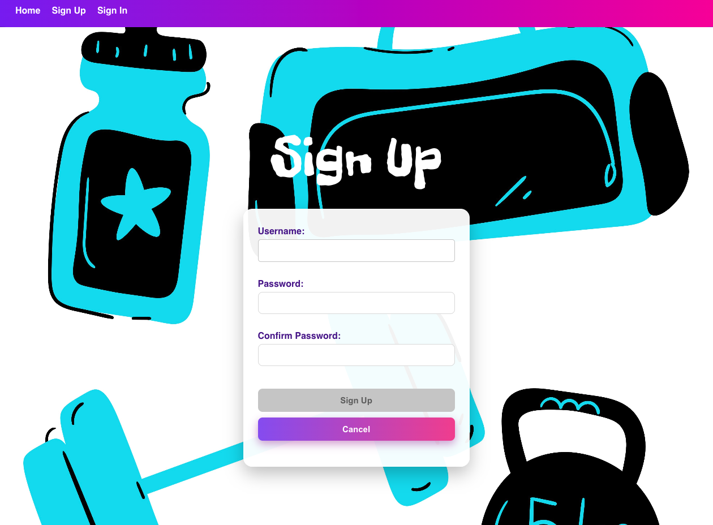
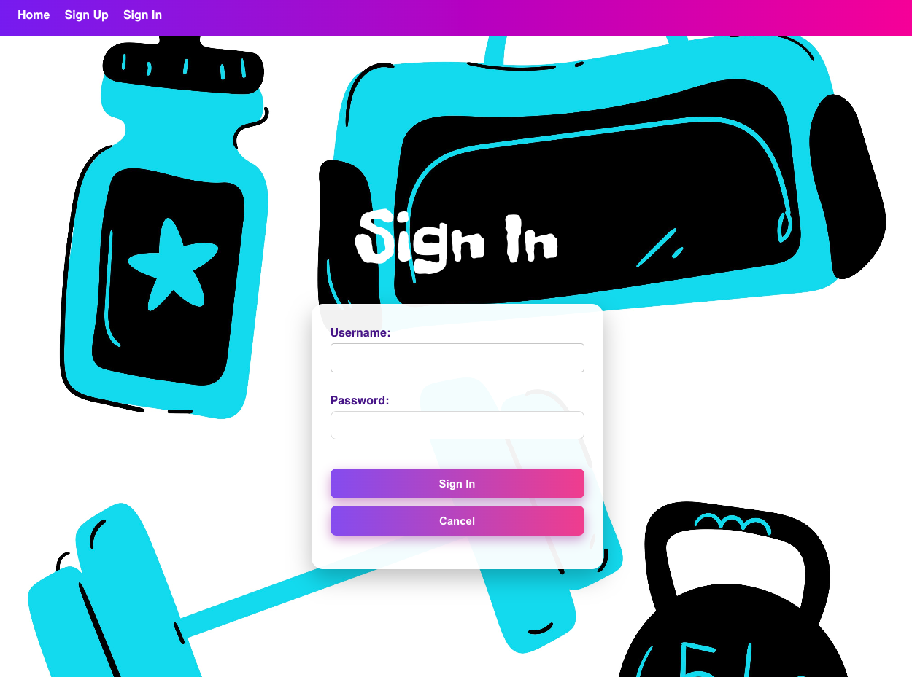
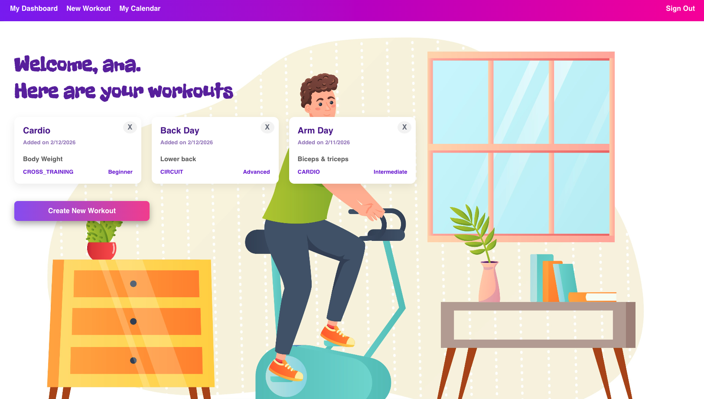
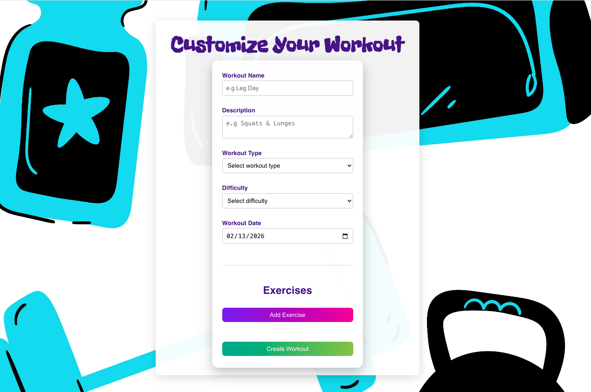
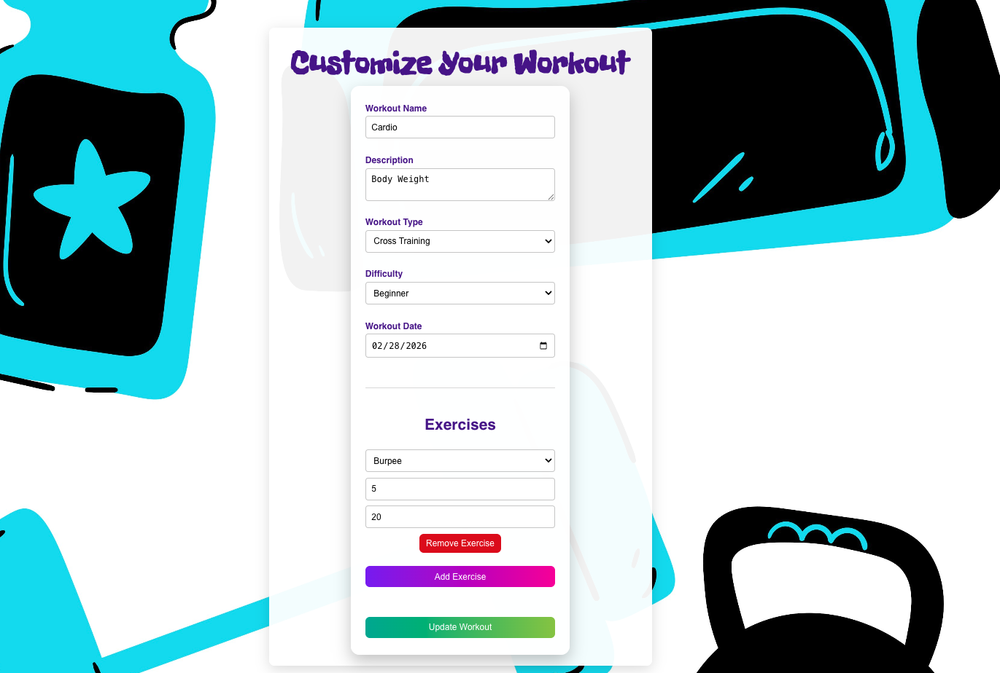
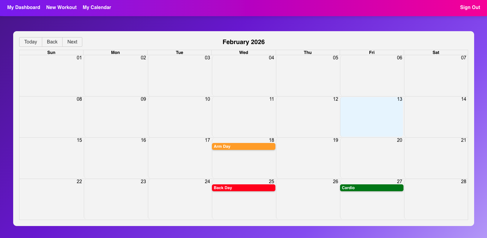

<h1 style="text-align: center;">GOALFIT APP</h1>

### 🔖 Description
---
GoalFit is a web application that helps you take control of your fitness journey. Track your workouts, schedule sessions, and monitor your progress—all in one place.

### 🏋️ Features 
---

- **Workout Logging**: Easily record your exercises, sets, reps, and personal notes for every session.  
- **Session Management**: Edit and update your workouts along with their associated logs effortlessly.  
- **Workout Scheduling**: Access your workout calendar and effortlessly plan your upcoming session.


### 📸 Screenshots 
---

| Description       | Screenshot |
| :----------------:| :------:   |
| <h3 align="center">Landing Page</h3>     |      |
| <h3 align="center">Sign Up </h3>   |  |
| <h3 align="center">Sign In </h3>   |  |
| <h3 align="center">Dashboard</h3>      |      |
| <h3 align="center">Create/Edit Workout</h3>       |      |
| <h3 align="center">Workout Details </h3>    |     |
| <h3 align="center">Calendar</h3>   |  |


### ⛰️ Getting started (USER) 
---
### App Flow

1. **Sign Up / Sign In**  
   Create an account or log in to get started.

2. **Profile Access**  
   After logging in, the app uploads 5-day weather data for random locations.

3. **Search for Places**  
   The search bar allows you to explore weather data for specific locations and add as many locations as you want to a personalized list.

4. **My Profile**  
   Your profile gives you access to the lists you have created. You can edit or delete any list you own, and you can also create new lists from here.

5. **View List**  
   When accessing your lists, you can view weather data for the locations you have added, leave comments on the list, and explore individual locations.

6. **View Location**  
   When accessing a specific location, you can log, edit, or delete activities you have completed at that location.

### 👨‍💻 Database management PostgreSQl (`goalfit_db`)

The following tables are part of the `goalfit_db` PostgreSQL database. The `workout_exercises` table is populated by combining the `workouts` and `exercises` tables.

---

- **exercises**

Stores information about individual exercises.

| Column        | Type         | Notes                     |
|---------------|-------------|---------------------------|
| `id`          | SERIAL       | Primary Key               |
| `name`        | VARCHAR(100)| Name of the exercise      |
| `muscle_group`| VARCHAR(50) | Target muscle group       |
| `equipment`   | VARCHAR(50) | Required equipment        |

```sql
CREATE TABLE exercises (
    id SERIAL PRIMARY KEY,
    name VARCHAR(100) NOT NULL,
    muscle_group VARCHAR(50),
    equipment VARCHAR(50)
);
```

- **workouts**

Stores information about workouts created by users.

| Column        | Type          | Notes                                    |
|---------------|--------------|-----------------------------------------|
| `id`          | SERIAL       | Primary Key                              |
| `author`      | INT          | References `users(id)`                   |
| `name`        | VARCHAR(100) | Name of the workout                       |
| `description` | TEXT         | Workout description                       |
| `workout_type`| VARCHAR(50)  | Type of workout (strength, cardio, etc.) |
| `difficulty`  | VARCHAR(50)  | Difficulty level                          |
| `created_at`  | TIMESTAMP    | Defaults to `CURRENT_TIMESTAMP`          |
| `workout_date`| DATE         | Defaults to `CURRENT_DATE`               |

```sql
CREATE TABLE workouts (
    id SERIAL PRIMARY KEY,
    author INT REFERENCES users(id),
    name VARCHAR(100) NOT NULL,
    description TEXT,
    workout_type VARCHAR(50),
    difficulty VARCHAR(50),
    created_at TIMESTAMP DEFAULT CURRENT_TIMESTAMP,
    workout_date DATE DEFAULT CURRENT_DATE
);
```
- **workout_exercises**

Associates workouts with exercises. **Populated by combining the `workouts` and `exercises` tables.**

| Column        | Type | Notes                                  |
|---------------|------|---------------------------------------|
| `workout_id`  | INT  | References `workouts(id)` with cascade delete |
| `exercise_id` | INT  | References `exercises(id)`            |
| `sets`        | INT  | Number of sets                         |
| `reps`        | INT  | Number of reps                         |
| **Primary Key** | `(workout_id, exercise_id)` | Ensures unique combination |

---

```sql
CREATE TABLE workout_exercises (
    workout_id INT REFERENCES workouts(id) ON DELETE CASCADE,
    exercise_id INT REFERENCES exercises(id),
    sets INT,
    reps INT,
    PRIMARY KEY(workout_id, exercise_id)
);
```
- **comments**

Stores comments made by users on workouts.

| Column        | Type          | Notes                                  |
|---------------|--------------|---------------------------------------|
| `id`          | SERIAL       | Primary Key                            |
| `workout_id`  | INT          | References `workouts(id)` with cascade delete |
| `author`      | INT          | References `users(id)`                 |
| `text`        | VARCHAR(250) | Comment text                           |
| `created_at`  | TIMESTAMP    | Defaults to `CURRENT_TIMESTAMP`       |

```sql
CREATE TABLE comments (
    id SERIAL PRIMARY KEY,
    workout_id INT REFERENCES workouts(id) ON DELETE CASCADE,
    author INT REFERENCES users(id),
    text VARCHAR(250),
    created_at TIMESTAMP DEFAULT CURRENT_TIMESTAMP
);
```

### :computer: Technologies Used
---
  
  
  
  
  
  
  
  
  
  
  
  
  
  
  

### ⏭️ Future Enhancements 
---
- Integrate a third-party music API (Spotify, Apple Music, etc.) to allow users to create playlists for their workouts.
- Create fitness goals, assign workouts to specific goals, and track progress over time.

##### Resources
---
- [react-calendar library ](https://www.npmjs.com/package/react-calendar).

### Links 🔗
---
- [Backend](https:)
- [Frontend](https:)
- [Deployed App](https:)


:rocket::boom: